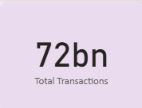
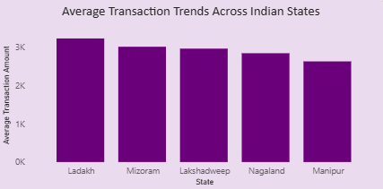
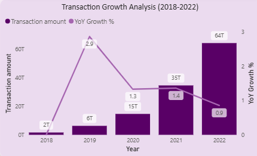
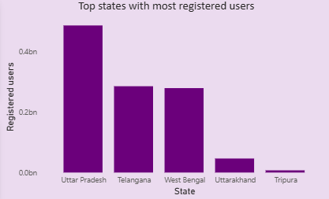
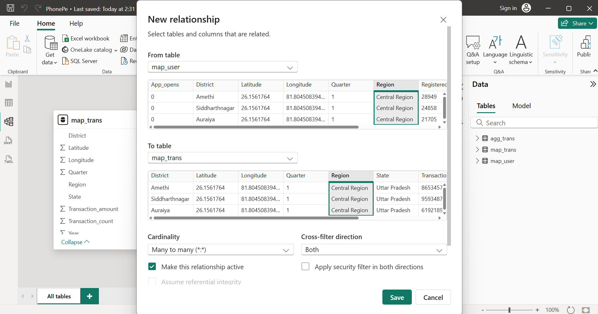
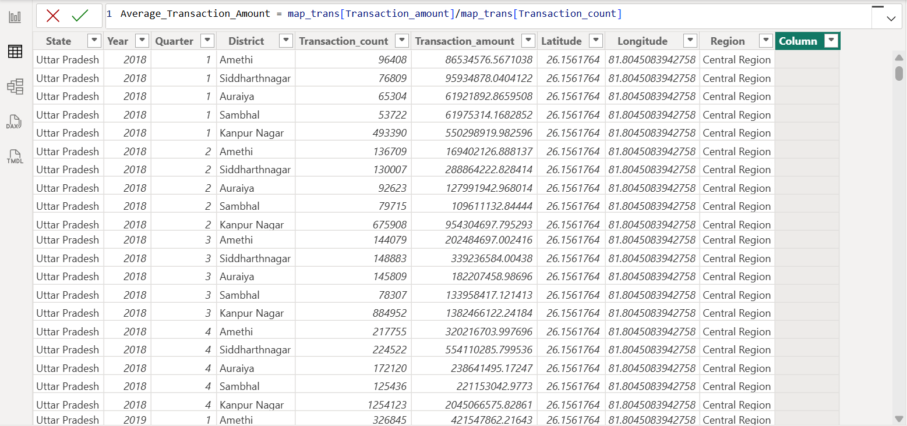

# PhonePe Pulse Digital-Payment-Analytics Dashboard

## Project Overview

 A comprehensive analysis of PhonePe's digital payment ecosystem across India from 2018-2022 is presented in this project. Power BI's advanced features including DAX calculations, data modeling, and interactive dashboards are leveraged to provide actionable business insights into transaction patterns, user growth, and regional adoption of digital payments.

---

## Business Problem

PhonePe, as a leading digital payments platform in India, faces challenges in understanding and optimizing their platform performance across multiple dimensions. Key challenges include:

- **Limited visibility** into transaction growth patterns and year-over-year performance trends
- **Fragmented understanding** of user adoption rates across different Indian states
- **Unclear insights** into regional variations in app usage and transaction behavior
- **Inability to analyze** temporal patterns in digital payment adoption
- **Need for dynamic reporting** that allows stakeholders to filter and explore data interactively
- **Requirement for data-driven decision making** to optimize regional strategies and user acquisition

---

## Business Questions Addressed

### 1. **Temporal Analysis**
- What is the overall transaction volume and value across India?
- How have transactions grown year-over-year from 2018 to 2022?
- Are there identifiable acceleration points in platform adoption?
- What are the growth trajectory patterns from 2018 to 2022?

### 2. **Transaction Performance**
- Which states lead in transaction amounts and volumes?
- What are the average transaction values across different states?
- How does payment behavior vary across regions?
- What is the correlation between transaction volume and value?

### 3. **User Growth Insights**
- What is the total registered user base on the PhonePe platform?
- How has user registration grown annually?
- Which states have the highest concentration of registered users?
- What is the relationship between app opens and registered users?

### 4. **Engagement Metrics**
- What is the total number of app opens across the platform?
- How does app engagement correlate with transaction activity?
- What are the year-over-year growth trends in app usage?
- Which states show the highest user engagement?

### 5. **Regional Performance**
- How does digital payment adoption vary across Indian states?
- Which regions are driving PhonePe's growth?
- What are the top-performing states in terms of transactions and users?
- How do northeastern states compare to other regions?

---

## Tools and Technologies Used

### **Microsoft Power BI**
- **Data Modeling**: Star schema with fact and dimension tables
- **Relationships**: Many-to-many relationships with bidirectional filtering
- **DAX (Data Analysis Expressions)**: Advanced calculations for YoY growth and averages

### **DAX Functions Used**
- **Time Intelligence**: SELECTEDVALUE for dynamic year selection
- **Aggregation**: SUM, CALCULATE for context modification
- **Variable Declarations**: VAR for readable and maintainable calculations
- **Error Handling**: DIVIDE with zero handling

### **Visualization Components**
- **Card Visuals**: High-impact KPI display
- **Bar Charts**: State-wise performance comparison
- **Line Charts**: Temporal trend analysis
- **Combo Charts**: Dual-axis for amount vs. growth percentage
- **Slicers**: Year range and state filters

### **Dashboard Design**
- **Multi-page architecture**: Separate dashboards for Transactions and Users
- **Color coding**: Purple theme consistent with PhonePe branding
- **Interactive elements**: Year sliders and state dropdowns
- **Top/Bottom toggles**: Dynamic switching between top and bottom performers

---

## Key Findings from Analysis

### **1. Transaction Growth Overview**



**Findings:**
- Total transactions reached **72 billion** across the analysis period
- Total transaction amount: **121.41 trillion INR**
- **Exponential growth pattern** from 2018 to 2022 with dramatic acceleration post-2020
- Transaction count grew from near zero in 2018 to approximately **40 billion in 2022**
- The growth curve shows **steady acceleration**, particularly pronounced from 2021-2022

**Implications:**
- Digital payment adoption in India has reached critical mass
- Post-COVID acceleration indicates permanent shift in payment behavior
- Platform infrastructure successfully scaled to handle exponential transaction growth

---

### **2. Average Transaction Value by State**




**Findings:**
- **Ladakh leads** with average transaction amount of **3K per transaction**
- **Mizoram** follows closely at **2.9K average** transaction value
- **Lakshadweep** maintains strong performance at **2.8K per transaction**
- **Nagaland** shows **2.7K average** transaction value
- **Manipur** rounds out top 5 at **2.5K per transaction**

**Implications:**
- Northeastern and remote regions show surprisingly high transaction values
- Smaller states demonstrate strong digital payment adoption
- High average values suggest usage for substantial purchases, not just micro-transactions
- Opportunity to replicate success factors in larger states

---

### **3. Transaction Growth Analysis (2018-2022)**



**Findings:**
- **2018 baseline**: 2T transactions with minimal YoY growth percentage
- **2019**: 6T transactions showing initial growth momentum
- **2020**: 13T transactions (1.3 YoY growth %) - COVID-19 acceleration begins
- **2021**: 35T transactions (1.4 YoY growth %) - significant jump of **20T+**
- **2022**: 64T transactions (0.9 YoY growth %) - **29T increase** but percentage growth normalizing

**Key Observations:**
- **Peak YoY growth percentage** occurred in 2019-2020 period
- **Largest absolute growth** happened between 2021-2022
- Growth rate percentage declining as base increases (normal maturation pattern)

**Implications:**
- Platform has moved from early adoption to mainstream usage phase
- While percentage growth slows, absolute transaction volumes continue strong expansion
- Market penetration reaching saturation in some segments

---

### **4. User Registration and Engagement**


**Findings:**
- **Total registered users**: 4.70 billion registrations
- **Total app opens**: 150.69 billion across analysis period
- **User growth**: Steady linear increase from ~0.3bn (2018) to ~1.7bn (2022)
- **App opens growth**: Parallel trajectory to user growth, indicating consistent engagement

**Implications:**
- Average user shows consistent engagement (multiple app opens per registration)
- User retention appears strong based on parallel growth curves
- Platform maintains active user base, not just dormant registrations

---

### **5. Top States by Registered Users**



**Findings:**
- **Uttar Pradesh dominates** with over 0.4bn registered users
- **Telangana** is second with approximately 0.2bn+ users
- **West Bengal** follows with similar numbers to Telangana
- **Uttarakhand** and **Tripura** complete the top 5
- Clear correlation between population and user registration

**Implications:**
- Large population states drive user base growth
- Per-capita penetration varies significantly across states
- Opportunity exists in underrepresented populous states

---

### **6. Yearly App Engagement Growth**


**Findings:**
- **2018**: Minimal app opens, establishing baseline
- **2019-2020**: Gradual upward trajectory
- **2021**: Noticeable acceleration in growth rate
- **2022**: Steep exponential growth to approximately 80bn app opens
- Growth rate accelerating (convex curve), not just linear

**Implications:**
- User engagement intensifying over time
- Each user opening app more frequently in recent years
- Platform stickiness and utility increasing

---

## Recommendations

### **1. Regional Expansion Strategy**

#### **Focus on High-Value Transaction States**
- **Replicate Ladakh/Mizoram success model** in other northeastern states
- **Investigate factors** driving high transaction values (tourism, remittances, local commerce)
- **Develop targeted campaigns** for similar demographic/economic profiles

#### **Population-Dense State Penetration**
- **Accelerate efforts** in Bihar, Madhya Pradesh, and Rajasthan where registration lags population
- **Localized marketing** in regional languages beyond Hindi and English
- **Partner with state governments** for digital payment initiatives

### **2. User Acquisition and Retention**

#### **Leverage Growth Momentum**
- **Capitalize on 2022 acceleration** with aggressive user acquisition campaigns
- **Focus on first-time digital payment users** in Tier 2 and Tier 3 cities
- **Student and youth programs** to build lifetime user value

#### **Engagement Enhancement**
- **Gamification features** to increase app open frequency
- **Daily rewards or streak bonuses** to drive habitual usage
- **Push notification optimization** based on user behavior patterns

### **3. Transaction Value Optimization**

#### **Increase Average Transaction Amount**
- **Bill payment integrations** (electricity, gas, insurance) to drive larger transactions
- **EMI and credit facilities** for high-value purchases
- **Merchant partnerships** with premium brands and retailers

#### **Micro-Transaction Support**
- **Maintain zero-fee structure** for small transactions in lower-value states
- **QR code penetration** in street vendors and small shops
- **Offline payment capabilities** for connectivity-challenged areas

### **4. Data-Driven Regional Strategies**

#### **State-Specific Approaches**
- **Uttar Pradesh**: Focus on depth (increasing transactions per user) given massive user base
- **Ladakh/Northeast**: Study and document success factors for replication
- **Southern States**: Leverage tech-savvy population for advanced features beta testing
- **Northern Plains**: Agricultural payment solutions (mandi payments, crop insurance)

### **5. Infrastructure and Technology**

#### **Scalability Preparations**
- **Anticipate 100bn+ annual transactions** by 2024-2025 based on growth curves
- **Edge computing solutions** for faster transaction processing in remote areas
- **Redundancy systems** to maintain 99.99% uptime during peak periods

#### **Analytics Enhancement**
- **Real-time dashboard** for operations team to monitor state-wise anomalies
- **Predictive models** for transaction volume forecasting
- **Churn prediction** to identify and retain at-risk users

### **6. Growth Acceleration Initiatives**

#### **COVID-Era Momentum Maintenance**
- **Digital-first campaigns** emphasizing convenience and safety
- **Touchless payment positioning** for health-conscious users
- **Senior citizen programs** to onboard older demographics

#### **Partnership Ecosystem**
- **E-commerce platform integrations** for seamless checkout
- **Government DBT (Direct Benefit Transfer)** integrations
- **Utility company partnerships** for recurring payment setup

### **7. Competitive Positioning**

#### **Market Share Defense**
- **Monitor Google Pay and Paytm** performance in key states
- **Differentiation through rewards** (cashback, loyalty points)
- **Exclusive merchant partnerships** in high-transaction categories

#### **Innovation Leadership**
- **Cryptocurrency/Web3 readiness** for future payment methods
- **Voice-based payments** for low-literacy user segments
- **Regional language AI assistants** for customer support

---

## Technical Implementation Details

### **Data Model Structure**


The project uses a **star schema** with two primary tables:

#### **map_trans (Fact Table)**
- Transaction_count
- Transaction_amount
- District, State, Region
- Quarter, Year
- Latitude, Longitude
- Average_Transaction_Amount (calculated column)

#### **map_user (Dimension Table)**
- Registered_users
- App_opens
- District, State, Region
- Quarter, Year

#### **Relationships**




- **Many-to-many** relationship between map_trans and map_user
- **Cardinality**: Complex relationship enabling cross-filtering
- **Active relationship** with bidirectional cross-filter enabled
- **Cross-filter direction**: Both tables filter each other

---

### **Key DAX Measures**

#### **1. Average Transaction Amount**



```DAX
Average_Transaction_Amount = 
    map_trans[Transaction_amount] / map_trans[Transaction_count]
```

**Purpose**: Calculate the average value per transaction at row level

---

#### **2. Year-over-Year Growth %**


```DAX
YoY Growth % = 
VAR CurrentYear = SELECTEDVALUE(map_trans[Year])
VAR PrevYear = CurrentYear - 1
VAR CurrentAmount = SUM(map_trans[Transaction_amount])
VAR PrevAmount = 
    CALCULATE(
        SUM(map_trans[Transaction_amount]),
        map_trans[Year] = PrevYear
    )
RETURN
    DIVIDE(CurrentAmount - PrevAmount, PrevAmount, 0)
```

**Technical Breakdown:**
- **Line 2**: Captures the currently selected year from slicer context
- **Line 3**: Calculates previous year for comparison
- **Line 4**: Sums transaction amount for current year
- **Lines 5-8**: Uses CALCULATE to modify filter context and get previous year's amount
- **Line 10**: Divides the difference by previous amount, returns 0 if division by zero

**Benefits of Using Variables:**
- More readable and maintainable code
- Calculations performed once and reused
- Easier debugging and testing

---

### **Dashboard Navigation**

#### **Transactions Dashboard**


**Features:**
1. **Year Slicer**: Dual-slider to filter data from 2018-2022 (default: all years selected)
2. **State Filter**: Dropdown menu to analyze specific states (default: All)
3. **Top/Bottom Toggle**: Radio buttons to switch between top 5 and bottom 5 states
4. **Clear All Slicers**: Button to reset all filters to default state

**Key Visualizations:**
- Total Transactions (Card)
- Total Transaction Amount (Card)
- Average Transaction Trends Across Indian States (Bar Chart)
- Yearly Growth in Transaction Count (Line Chart)
- Transaction Growth Analysis (Combo Chart with Amount and YoY%)

---

#### **Users Dashboard**


**Features:**
1. **Year Range Selector**: Dual slider for custom date range (2018-2022)
2. **State Dropdown**: Filter by individual state or view all
3. **Clear All Slicers**: Reset filters button
4. **Metric Cards**: High-level KPIs displayed prominently

**Key Visualizations:**
- Total App Opens (Card): 150.69bn
- Total Registered Users (Card): 4.70bn
- Top States with Most Registered Users (Bar Chart)
- Yearly Growth of Registered Users (Line Chart)
- Yearly App Opens Growth (Line Chart)

---

## Dashboard Features

### **Interactive Elements**
- **Dynamic KPI cards** that update based on slicer selections
- **Cross-filtering** between visualizations for exploratory analysis
- **Tooltip enhancements** showing additional metrics on hover
- **Responsive design** that adapts to different screen sizes

### **Visualization Types Used**
- **Card visuals**: For prominent KPI display (72bn transactions, 121.41T amount)
- **Bar charts**: State-wise comparisons (horizontal bars for easy label reading)
- **Line charts**: Temporal trends showing growth over time
- **Combo charts**: Transaction amount vs. YoY growth % correlation
- **Slicers**: Year range slider and state dropdown filters

### **Design Principles**
- **Purple color palette**: Consistent with PhonePe brand identity (#5f259f)
- **High contrast**: White text on purple background ensures readability
- **Minimalist approach**: Focus on data with minimal decorative elements
- **Logical layout**: Left-to-right, top-to-bottom reading pattern
- **Visual hierarchy**: Larger fonts for key metrics, smaller for supporting data

---

## Data Insights Summary

| Metric | Value | Year Range | Growth Pattern |
|--------|-------|------------|----------------|
| **Total Transactions** | 72 billion | 2018-2022 | Exponential |
| **Total Amount** | 121.41 trillion INR | 2018-2022 | Exponential |
| **Registered Users** | 4.70 billion | 2018-2022 | Linear |
| **App Opens** | 150.69 billion | 2018-2022 | Exponential |
| **Peak YoY Growth** | 140% | 2020-2021 | COVID acceleration |
| **Top State (Avg Transaction)** | Ladakh (3K) | - | Consistent |
| **Top State (Users)** | Uttar Pradesh (0.4bn+) | - | Population-driven |
| **2022 Transactions** | ~40 billion | Single year | Platform maturity |

---

## Key Learnings

### **Technical Skills Demonstrated**
- **Complex DAX measure creation** using variables and time intelligence functions
- **Many-to-many relationship management** in Power BI data models
- **Interactive dashboard design** with multiple slicer types and toggle buttons
- **Data modeling best practices** implementing star schema architecture
- **Year-over-year growth calculation methodology** with context modification
- **Calculated columns vs. measures** understanding when to use each

### **Business Intelligence Insights**
- **Digital payment adoption patterns** in developing economies
- **Regional variation analysis** in fintech adoption across diverse geographies
- **User engagement metrics interpretation** (app opens to user ratio)
- **Growth trajectory analysis** and implications for forecasting
- **COVID-19 impact assessment** on digital transformation acceleration

### **Domain Knowledge Gained**
- **Indian digital payments ecosystem** structure and competitive landscape
- **State-wise demographic and economic variations** affecting adoption
- **Payment behavior patterns** across different regions and demographics
- **Northeastern states' unique characteristics** in high-value transactions
- **Urban-rural divide** in digital payment penetration

---

## How to Use This Dashboard

### **Prerequisites**
- Microsoft Power BI Desktop (latest version)
- Windows 10 or later (for optimal performance)
- Minimum 8GB RAM recommended
- Dataset files downloaded from Kaggle

### **Setup Instructions**

1. **Download the Dataset**
```
   Visit: https://www.kaggle.com/datasets/nirmalcodes/phonepe-pulse-data-2018-2022
   Download: map_trans.csv and map_user.csv
```

2. **Open Power BI File**
   - Double-click `PhonePePulse.pbix`
   - Power BI Desktop will launch automatically

3. **Update Data Source** (if file paths have changed)
   - Go to Home → Transform Data → Data Source Settings
   - Update file paths to point to your downloaded CSV files
   - Click "Close & Apply"

4. **Refresh Data**
   - Click Home → Refresh
   - Wait for data to load (may take 1-2 minutes depending on system)

5. **Navigate Dashboard**
   - Use bottom tabs to switch between "Transactions" and "Users" pages
   - Interact with slicers to filter data
   - Hover over visuals for detailed tooltips
   - Click on bars/lines to cross-filter other visuals

### **Dashboard Interaction Guide**

#### **Filtering Data**
- **Year Selection**: Drag the year slider endpoints to select specific year range
- **State Selection**: Click dropdown and choose one or multiple states
- **Top/Bottom Toggle**: Click radio button to switch between top 5 and bottom 5 performers
- **Clear Filters**: Click "Clear all slicers" button to reset to default view

#### **Reading Visualizations**
- **Card Metrics**: Large numbers show totals across selected filters
- **Bar Charts**: Longer bars indicate higher values; hover for exact numbers
- **Line Charts**: Upward slope indicates growth; steeper = faster growth
- **Combo Charts**: Left axis for amount, right axis for percentage

#### **Cross-Filtering**
- Click any bar in state chart → other visuals update to show that state
- Click any point on line chart → filters to that specific year
- Click again to deselect and return to full view

---

## Use Cases

### **For Business Executives**
- **Strategic Planning**: Identify high-growth regions for expansion investment
- **Performance Monitoring**: Track YoY growth against targets
- **Board Presentations**: Export visuals for quarterly business reviews
- **Competitive Analysis**: Benchmark against industry growth rates

### **For Regional Managers**
- **State Performance**: Deep-dive into specific state metrics
- **Target Setting**: Use historical data to set realistic targets
- **Campaign Planning**: Identify underperforming regions needing attention
- **Success Replication**: Study top-performing states for best practices

### **For Product Teams**
- **Feature Impact**: Correlate app opens with feature releases
- **Engagement Metrics**: Monitor user stickiness through app open frequency
- **User Onboarding**: Track registered user to active user conversion
- **Platform Health**: Identify unusual drops in engagement

### **For Data Analysts**
- **Trend Analysis**: Identify seasonality and cyclical patterns
- **Statistical Modeling**: Export data for advanced statistical analysis
- **A/B Testing**: Compare performance across different regions/time periods
- **Report Automation**: Schedule and distribute regular reports

---

### **Datasets**
- Original Dataset: [Kaggle - PhonePe Pulse Data](https://www.kaggle.com/datasets/nirmalcodes/phonepe-pulse-data-2018-2022)
- PhonePe Open Data Initiative: Check PhonePe Pulse for latest releases

---

## Acknowledgments

- **Data Source**: [PhonePe Pulse Data 2018-2022](https://www.kaggle.com/datasets/nirmalcodes/phonepe-pulse-data-2018-2022) by Nirmal Kumar on Kaggle
- **PhonePe**: For open data initiative enabling research and analysis
- **Tools**: Microsoft Power BI Desktop for powerful analytics capabilities
- **Analysis Framework**: Business Intelligence and Data Visualization Best Practices
- **Inspiration**: PhonePe's commitment to transparent data sharing for India's digital payment ecosystem understanding

---

## License & Usage Terms

### **Data License**
- Original dataset published under open data initiative by PhonePe
- Available publicly through Kaggle platform
- Subject to Kaggle's Terms of Use and dataset-specific license

---


*This dashboard represents a comprehensive analysis of India's digital payment revolution through PhonePe platform data. The insights derived support data-driven decision making for fintech strategy, regional expansion, and user growth initiatives.*
